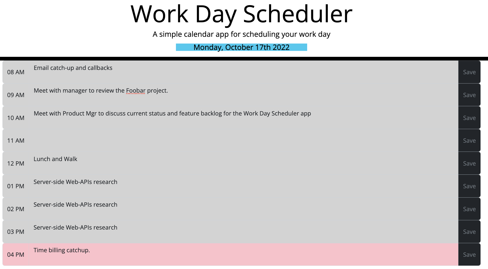

# Work Day Scheduler
Module 5 - Web APIs - Module Challenge: a Work Day Scheduling application

## Description

Provide a short description explaining the what, why, and how of your project. Use the following questions as a guide:

- What was your motivation?
This project provides a web-based interface where a user can log scheduled activities for today (the current day) during regular business hours.  Business hours are set by variables in the script.js file, and are currently set to 8am to 5 pm.

This project is part of a web development bootcamp, and builds on previous experience gained in HTML, CSS, and Javascript by incorporating use of multiple 3rd-party web-development libraries.  In particular, this project uses Bootstrap for styling, JQuery for element creation and event-handling, and Moment.js for implementation of time-based functionality.

## Table of Contents (Optional)

If your README is long, add a table of contents to make it easy for users to find what they need.

- [Installation](#installation)
- [Usage](#usage)
- [License](#license)
- [Features](#features)

## Installation

See this project deployed live:

[Work Day Scheduler](https://iseanc.github.io/work-day-scheduler/)

## Usage

Instructions for use: 
- The page displays the current date in the page header.  Times are assumed to be your computer's current time zone.
- When the page loads, any previous entries you have created will be loaded from Local Storage.
- Hour blocks are color coded relative to the current time (local time zone):
```
GREY: Time is past.
RED: The current hour.
GREEN: Time is later in the day
```

- To add new entries or edit existing entries, click in a text and enter/modify notes.
- To remove an entry, you must edit and remove all text.
- Click the Save button to save changes.


NOTE: This tool is currently assumes all calendar entries apply to the current day, even if they were entered on a previous day.  It also assumes all meeting entries are one hour long with start and end times at the beginning and end of each hour.  This is because the calendar area is only "hour-aware".  The app is not storing or using start and end dates. 




## License

The last section of a high-quality README file is the license. This lets other developers know what they can and cannot do with your project. If you need help choosing a license, refer to [https://choosealicense.com/](https://choosealicense.com/).


## Features

Primary features of this project:

- The current date (your PCs local time) is displayed at the top of the screen.
- Hour blocks are color coded relative to the current hour (current hour is red, etc).
- Text entries are stored in local storage.  Previous entries will be displayed if the web page is closed and reopened.  Entries can be updated as needed.